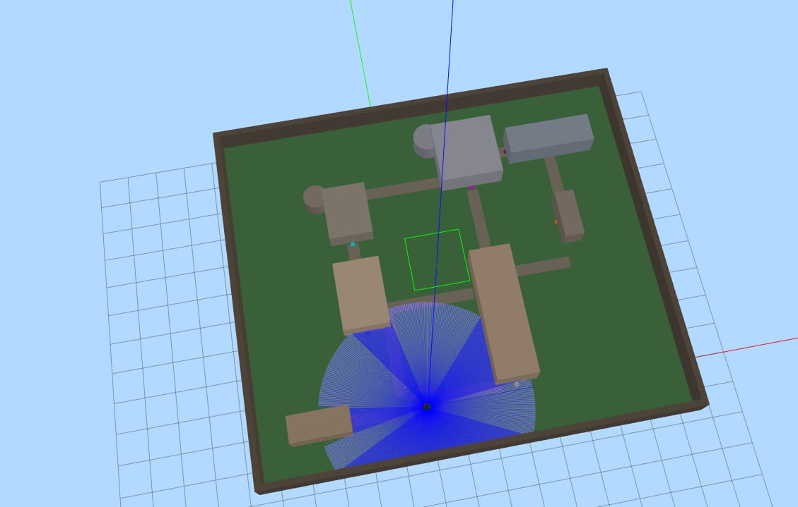

# Autonomous Multi-point Campus Navigation

TSP-based path planning for a TurtleBot3 navigating 8 locations on a simulated Northeastern University campus. We compare two approaches: Christofides algorithm and Christofides + 2-opt optimization.



## What's Here

```
├── algorithm/
│   ├── christofides.py         # standard christofides
│   └── christofides_2opt.py    # with 2-opt local search
├── maps/
│   ├── neu.map.pgm
│   └── neu.map.yaml
├── world/
│   └── warehouse_tsp.world
├── launch/
│   └── warehouse_tsp.launch.py
└── media/
    └── ...
```

## The Problem

Visit 8 building entrances and return to start, minimizing total distance. Classic Traveling Salesman Problem.

**Waypoints:** Origin (Quad) → Dodge → Ell → Richards → Curry → Snell Library → Churchill → Snell Engineering

## Results

| Algorithm | Distance | Notes |
|-----------|----------|-------|
| Christofides | 28.59m | guaranteed ≤1.5× optimal |
| Christofides + 2-opt | 27.43m | 4.1% shorter |

The MST lower bound is ~21.08m, so both solutions are pretty close to theoretical best.

### Map Generation 


### Christofides


### Christofides + 2-opt


## Prerequisites

- Ubuntu 22.04
- ROS2 Humble
- Nav2
- TurtleBot3 packages

## Setup

**1. Clone TurtleBot3 simulation packages**

```bash
cd ~/tb3_ws/src
git clone -b humble-devel https://github.com/ROBOTIS-GIT/turtlebot3_simulations.git
```

**2. Copy world and launch files**

Take `warehouse_tsp.world` from this repo and drop it into:
```
turtlebot3_simulations/turtlebot3_gazebo/worlds/
```

Take `warehouse_tsp.launch.py` from this repo and drop it into:
```
turtlebot3_simulations/turtlebot3_gazebo/launch/
```

**3. Create the package**

```bash
cd ~/tb3_ws/src
mkdir -p warehouse_tsp
```

Copy `algorithm/`, `maps/` into `warehouse_tsp/`. Set it up as a ROS2 Python package (add `setup.py`, `package.xml`, etc).

**4. Build**

```bash
cd ~/tb3_ws
colcon build
source install/setup.bash
```

**5. Set TurtleBot3 model**

```bash
export TURTLEBOT3_MODEL=burger
```

## Running

**Terminal 1 — Launch Gazebo**
```bash
ros2 launch turtlebot3_gazebo warehouse_tsp.launch.py x_pose:=0.0 y_pose:=0.0
```

**Terminal 2 — Launch Nav2**
```bash
ros2 launch turtlebot3_navigation2 navigation2.launch.py map:=~/tb3_ws/src/warehouse_tsp/maps/neu.map.yaml
```

**Terminal 3 — Set initial pose in RViz**, then run one of:

```bash
# Standard Christofides
ros2 run warehouse_tsp christofides

# Christofides + 2-opt
ros2 run warehouse_tsp christofides_20pt
```

## Notes

Some waypoints had to be manually tuned to stay clear of walls. Nav2's costmap inflation (~0.3m) will reject goals that are too close to obstacles. The coordinates in the algorithm files already account for this.

## Contributors

- [sailokeish](https://github.com/sailokeish)
- Clifford Co (clifford.co@northeastern.edu) <!-- add GitHub link when available -->
